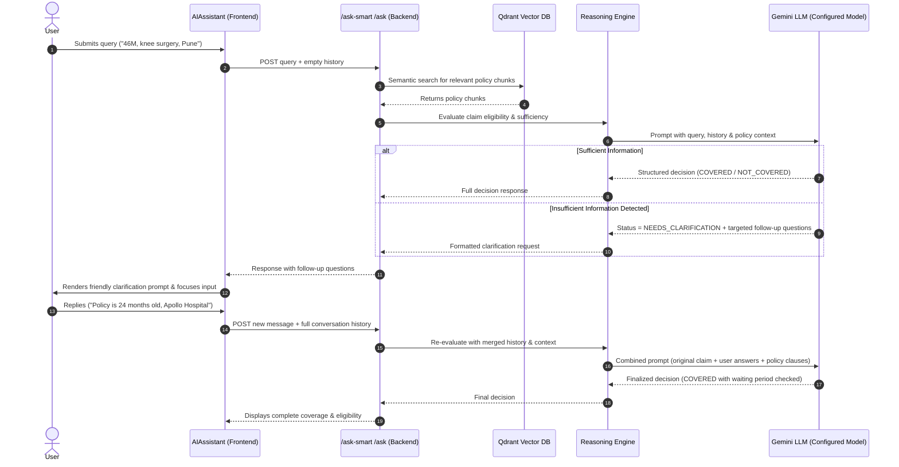

# Architecture Overview

## Sequence Diagram

```mermaid
sequenceDiagram
    autonumber
    actor User
    participant UI as AIAssistant (Frontend)
    participant API as /ask-smart /ask (Backend)
    participant Qdrant as Qdrant Vector DB
    participant Engine as Reasoning Engine
    participant Gemini as Gemini LLM (Configured Model)

    User->>UI: Submits query ("46M, knee surgery, Pune")
    UI->>API: POST query + empty history
    API->>Qdrant: Semantic search for relevant policy chunks
    Qdrant-->>API: Returns policy chunks
    API->>Engine: Evaluate claim eligibility & sufficiency
    Engine->>Gemini: Prompt with query, history & policy context
    alt Sufficient Information
        Gemini-->>Engine: Structured decision (COVERED / NOT_COVERED)
        Engine-->>API: Full decision response
    else Insufficient Information Detected
        Gemini-->>Engine: Status = NEEDS_CLARIFICATION + targeted follow-up questions
        Engine-->>API: Formatted clarification request
    end
    API-->>UI: Response with follow-up questions
    UI->>User: Renders friendly clarification prompt & focuses input

    User->>UI: Replies ("Policy is 24 months old, Apollo Hospital")
    UI->>API: POST new message + full conversation history
    API->>Engine: Re-evaluate with merged history & context
    Engine->>Gemini: Combined prompt (original claim + user answers + policy clauses)
    Gemini-->>Engine: Finalized decision (COVERED with waiting period checked)
    Engine-->>API: Final decision
    API-->>UI: Displays complete coverage & eligibility
```

