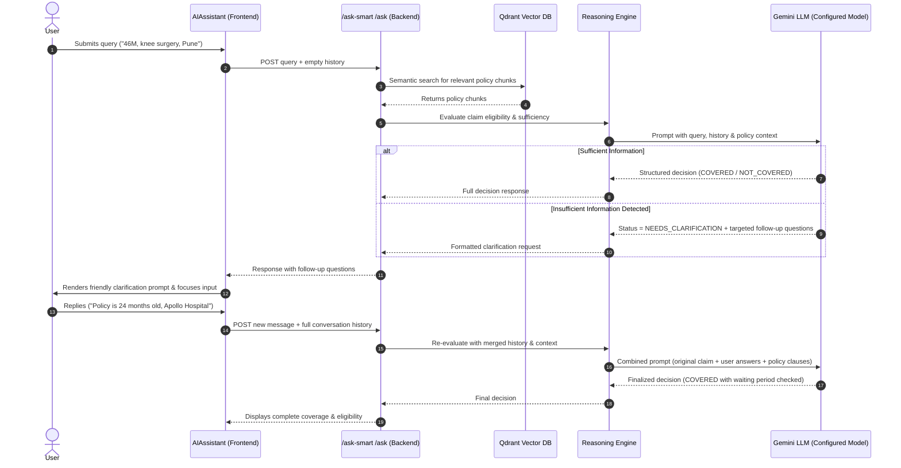

# Implementation Plan: Centralized Model Configuration & Conversational Clarification Architecture

## Problem Summary
1. **Model Hardcoding**: The Gemini model name (`gemini-flash-latest` / `gemini-1.5-flash`) is repeated across multiple backend files (`reasoningEngine.js`, `ask.js`), making model switching error-prone and tedious.
2. **Dead-End "Insufficient Info" Responses**: When a user's query lacks key details (or when parsing/retrieval is inconclusive), the system produces a static, unhelpful dead-end message:
   ```text
   ❓ QUICK DECISION: INSUFFICIENT INFO
   Summary: Unable to analyze due to processing error
   Coverage: Not specified% ...
   ```
   Instead of abruptly halting, the system should recognize missing details, formulate targeted follow-up questions, and maintain conversational context across turns so that the user's subsequent reply completes the evaluation.

---

## Architecture Overview



---

## User Review Required

> [!IMPORTANT]
> **Conversation History Flow**: To enable multi-turn clarification, the frontend will now send recent conversation history (`history: [...]`) along with the query to `/ask` and `/ask-smart`. The backend will maintain stateless scalability while allowing the LLM to remember previous questions and answers.

> [!NOTE]
> **Centralized Model Configuration**: We will introduce a single source of truth (`GEMINI_MODEL` in `.env` and `config/aiConfig.js`), defaulting to `gemini-3.6-flash`. Changing it in `.env` will instantly switch the model across all reasoning, summarization, and decision routines.

---

## Proposed Changes

### Component 1: Centralized Model Configuration

#### [NEW] [backend/config/aiConfig.js](file:///C:/Users/pragy/finesse/backend/config/aiConfig.js)
- Create a dedicated configuration module that exports:
  ```javascript
  const GEMINI_MODEL = process.env.GEMINI_MODEL || "gemini-3.6-flash";
  module.exports = { GEMINI_MODEL };
  ```
- Any future model changes can be done by editing `GEMINI_MODEL` in [backend/.env](file:///C:/Users/pragy/finesse/backend/.env) without touching any code.

#### [MODIFY] [backend/.env](file:///C:/Users/pragy/finesse/backend/.env)
- Add `GEMINI_MODEL=gemini-3.6-flash`.

#### [MODIFY] [backend/llm/reasoningEngine.js](file:///C:/Users/pragy/finesse/backend/llm/reasoningEngine.js)
- Import `GEMINI_MODEL` from `../config/aiConfig`.
- Replace all hardcoded model names in `generateReasonedResponse`, `generateStructuredDecision`, `summarizeDocuments`, and `analyzeClaimEligibility` with `GEMINI_MODEL`.

#### [MODIFY] [backend/routes/ask.js](file:///C:/Users/pragy/finesse/backend/routes/ask.js)
- Import `GEMINI_MODEL` from `../config/aiConfig`.
- Replace hardcoded model strings in response metadata with `GEMINI_MODEL`.

---

### Component 2: Multi-Turn Conversational Clarification

#### [MODIFY] [backend/llm/promptTemplates.js](file:///C:/Users/pragy/finesse/backend/llm/promptTemplates.js)
- Update `createAnalysisPrompt` and system prompts to accept conversation history.
- Add instructions for clarification:
  - When the query is missing critical details necessary to determine policy coverage (e.g. policy duration, specific treatment type, network vs. non-network hospital, pre-existing condition duration), the model should **not** return a dead-end rejection.
  - Instead, the model should explain what it found in the policy so far and ask 1–3 specific, numbered clarifying questions.

#### [MODIFY] [backend/llm/reasoningEngine.js](file:///C:/Users/pragy/finesse/backend/llm/reasoningEngine.js)
- Update `generateStructuredDecision`:
  - Add `NEEDS_CLARIFICATION` as a recognized decision status.
  - Parse `MISSING_INFORMATION` and `FOLLOW_UP_QUESTIONS` fields from Gemini's response.
  - Improve error handling so internal exceptions (e.g. network/API errors) return an explicit error instead of disguising as `INSUFFICIENT_INFO`.
- Update `generateReasonedResponse`:
  - Accept optional `conversationHistory` array and format it into the Gemini context.
  - When user responds to previous clarification, synthesize the full context to render final eligibility.

#### [MODIFY] [backend/routes/ask.js](file:///C:/Users/pragy/finesse/backend/routes/ask.js)
- In both `/ask` and `/ask-smart` endpoints:
  - Accept `history` parameter from `req.body` (defaulting to `[]`).
  - Pass `history` down to the reasoning engine functions.

#### [MODIFY] [frontend/src/components/features/AIAssistant.jsx](file:///C:/Users/pragy/finesse/frontend/src/components/features/AIAssistant.jsx)
- **Send History**: In `handleAskAI` and `getQuickDecision`, pass recent conversation history in the POST body to `/ask` and `/ask-smart`.
- **Render Clarification Friendly UI**:
  - Update `formatQuickDecision`:
    - When `status === 'NEEDS_CLARIFICATION'`, display:
      ```text
      💬 **QUICK DECISION: DETAILS NEEDED TO CONFIRM**

      **Summary:** [What was found in the policy so far]

      **Questions for you:**
      1. [First question]
      2. [Second question]

      **Next Step:** Reply below with your answers to get your final coverage determination.
      ```
    - Provide quick response chips or automatically keep focus in the input box so the user can easily reply.

---

## Verification Plan

### Automated Verification
- Run a Node.js test script sending a multi-turn conversation sequence:
  1. Turn 1: `"46M, knee surgery, Pune"` -> expect status `NEEDS_CLARIFICATION` with follow-up questions asking for policy duration or network hospital.
  2. Turn 2: `"The policy has been active for 3 years, and hospital is Apollo"` -> expect finalized `COVERED` or `PARTIALLY_COVERED` decision with policy reasoning.
- Verify changing `GEMINI_MODEL=gemini-3.6-flash` in `.env` immediately reflects in backend metadata and responses.

### Manual Verification
- In the frontend UI:
  1. Click a Quick Decision query like `"46M, knee surgery, Pune"`.
  2. Verify it prompts for missing details gracefully instead of showing `❓ QUICK DECISION: INSUFFICIENT INFO`.
  3. Type the missing details into the chat input and click Ask.
  4. Verify the assistant responds with the complete, accurate decision referencing the uploaded document.
